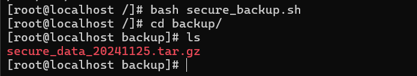
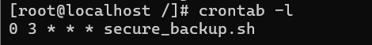
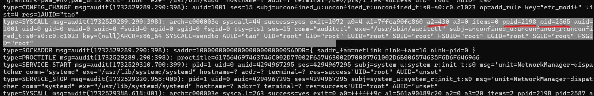

# TP Avancé : "Mission Ultime : Sauvegarde et Sécurisation"

 

## Étape 1 : Analyse et nettoyage du serveur

 

**Lister les tâches cron pour détecter des backdoors :**

    [root@localhost /]# cat etc/passwd

    [root@localhost /]# crontab -u attacker -l
        ==> attacker:
        */10 * * * * /tmp/.hidden_script
 

**Identifier et supprimer les fichiers cachés :**

    [root@localhost tmp]# ls -a
    [root@localhost tmp]# rm malicious.sh

    [root@localhost tmp]# rm .nop

    [root@localhost home]# userdel attacker
    [root@localhost home]# rm -rf attacker

 

**Analyser les connexions réseau actives :**

    [root@localhost home]# ss

 

## Étape 2 : Configuration avancée de LVM

 

**Créer un snapshot de sécurité pour /mnt/secure_data :**

    [root@localhost secure_data]# lvcreate -L 500MB -s -n snap_data /dev/vg_secure/secure_data

    [root@localhost /]# umount /mnt/secure_data/

    [root@localhost /]# lvconvert --merge /dev/vg_secure/snap_data

    [root@localhost /]# mount /dev/vg_secure/secure_data /mnt/secure_data/

 

**Optimiser l’espace disque :**

    [root@localhost /]# lvextend -L +100MB /dev/vg_secure/secure_data

 

## Étape 3 : Automatisation avec un script de sauvegarde

 

**Créer un script secure_backup.sh :**

    [root@localhost /]# nano secure_backup.sh

        SOURCE_DIR="/mnt/secure_data"
        BACKUP_DIR="/backup"
        BACKUP_FILE="$BACKUP_DIR/secure_data_$(date +\%Y\%m\%d).tar.gz"

        tar --exclude="*.tmp" --exclude="*.log" --exclude=".*" -czf "$BACKUP_FILE" >

 

**Ajoutez une fonction de rotation des sauvegardes :**

    J'ajoute la commande suivante au script :
        find "$BACKUP_DIR" -name "secure_data_*.tar.gz" -mtime +6 -exec rm {} \;

 

**Testez le script :**

    [root@localhost backup]# ls
        secure_data_20241125.tar.gz

 

**Automatisez avec une tâche cron :**

    [root@localhost /]# crontab -e

    J'ajoute la ligne suivante au fichier : 
        0 3 * * * secure_backup.sh

    [root@localhost /]# crontab -l
        0 3 * * * secure_backup.sh

 

## Étape 4 : Surveillance avancée avec auditd

 

**Configurer auditd pour surveiller /etc :**

    [root@localhost /]# auditctl -w /etc -p wa -k etc_modif

 

**Tester la surveillance :**

    [root@localhost /]# rm /etc/aaaaaa

    [root@localhost /]# ausearch -k etc_modif
        ----
        time->Mon Nov 25 11:08:09 2024
        type=PROCTITLE msg=audit(1732529289.290:398): proctitle=617564697463746C002D77002F657463002D70007761002D6B006574635F6D6F646966
        type=SOCKADDR msg=audit(1732529289.290:398): saddr=100000000000000000000000
        type=SYSCALL msg=audit(1732529289.290:398): arch=c000003e syscall=44 success=yes exit=1072 a0=4 a1=7ffca90fc860 a2=430 a3=0 items=0 ppid=2198 pid=2565 auid=1001 uid=0 gid=0 euid=0 suid=0 fsuid=0 egid=0 sgid=0 fsgid=0 tty=pts1 ses=15 comm="auditctl" exe="/usr/sbin/auditctl" subj=unconfined_u:unconfined_r:unconfined_t:s0-s0:c0.c1023 key=(null)
        type=CONFIG_CHANGE msg=audit(1732529289.290:398): auid=1001 ses=15 subj=unconfined_u:unconfined_r:unconfined_t:s0-s0:c0.c1023 op=add_rule key="etc_modif" list=4 res=1

[root@localhost audit]# cat audit.log

 

**Analyser les événements :**

    [root@localhost audit]# ausearch -k etc_changes > /var/log/audit_etc.log

 

## Étape 5 : Sécurisation avec Firewalld

 

**Configurer un pare-feu pour SSH et HTTP/HTTPS uniquement :**

    [root@localhost audit]# sudo firewall-cmd --permanent --add-service=ssh

    [root@localhost audit]# sudo firewall-cmd --permanent --add-service=http
    
    [root@localhost audit]# sudo firewall-cmd --permanent --add-service=https

    [root@localhost audit]# sudo firewall-cmd --set-default-zone=drop

    [root@localhost audit]# sudo firewall-cmd --reload

 

**Bloquer des IP suspectes :**

    [root@localhost log]# grep -a "Failed password" /var/log/secure

    [root@localhost log]# sudo firewall-cmd --permanent --add-rich-rule='rule family="ipv4" source address="203.0.113.42" reject'
    success

    [root@localhost log]# sudo firewall-cmd --list-all
      rich rules:
        rule family="ipv4" source address="203.0.113.42" reject

 

**Restreindre SSH à un sous-réseau spécifique :**

    [root@localhost log]# sudo firewall-cmd --permanent --zone=public --add-source=192.168.0.0/24
    
    [root@localhost log]# sudo firewall-cmd --permanent --zone=public --remove-service=ssh

    [root@localhost log]# sudo firewall-cmd --reload

    
